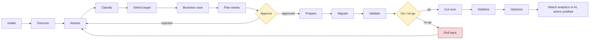
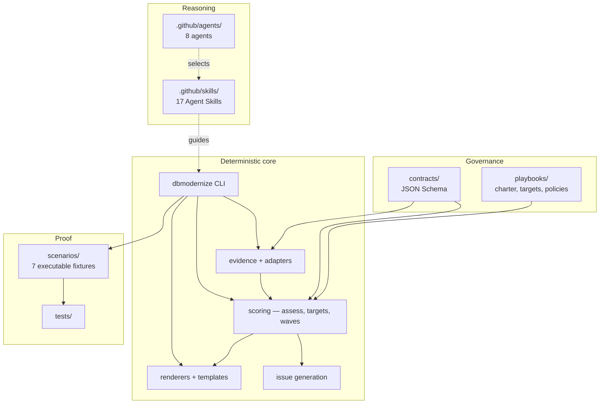
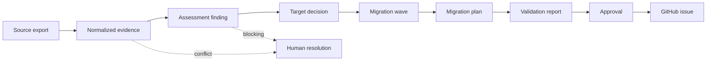
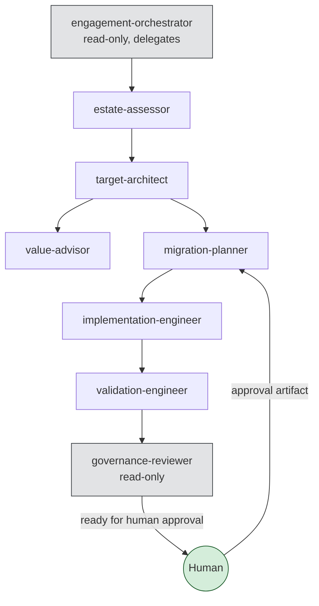

# FY27 Database Modernization Factory

A guided, evidence-based factory for database modernization on Azure. It turns estate
evidence into auditable decisions, waves, plans, and GitHub issues — and it stops when the
evidence runs out.

**It does not migrate, deploy, cut over, or delete anything.** It produces proposals that
humans review, approve, and execute. That boundary is enforced in code, not just in prose.

---

## Five minutes

```bash
git clone <this-repo>
cd fy27-database-modernization-factory
python -m pip install -e ".[dev]"
dbmodernize validate-scenario scenarios
```

That last command runs seven complete engagements offline — no Azure subscription, no
database, no language model, no network — and compares every generated artifact with the
committed expectation.

On Linux or macOS, `make install-dev` and `make gate` do the same and more. **`make` is not
installed on Windows by default**, so the commands in this README are written to work
without it. `make gate` is the union of these:

```bash
python -m ruff format --check src tests scripts
python -m ruff check src tests scripts
python -m mypy
python -m pytest tests
dbmodernize validate-repo
dbmodernize validate-playbook playbooks/default
dbmodernize validate-skill .github/skills
dbmodernize validate-agent .github/agents
dbmodernize validate-scenario scenarios
```

### See what it produces

```bash
dbmodernize render-plan \
  --engagement scenarios/01-sql2016-to-managed-instance/input/engagement.yaml \
  --input scenarios/01-sql2016-to-managed-instance/input \
  --out demo-output
```

Twelve documents, from one CSV and one JSON file:

```text
assessment-summary.md     target-decision.md        migration-waves.md
executive-brief.md        migration-plan-1.md       migration-plan-2.md
cutover-plan-1.md         rollback-plan-1.md        validation-plan-1.md
cutover-plan-2.md         rollback-plan-2.md        validation-plan-2.md
```

Open `target-decision.md` first. The section worth reading is the one at the top:

```markdown
## Workloads with no recommendation

These workloads have open blocking findings. No target is proposed for them, because a
target chosen from incomplete evidence is a guess wearing a decision's clothes.

- `wl-store-operations` — Store operations
```

Four workloads got a recommendation. One did not, and the document says why. That refusal
is the product.

---

## Use it on your own estate

Four commands. Nothing here touches Azure or any database.

**1. Scaffold an engagement.**

```bash
dbmodernize init --engagement-id acme-fy27 --out engagements
```

You get `engagements/acme-fy27/` containing `input/engagement.yaml`,
`input/inventory.csv`, and a README. The command prints the next step.

**2. Fill in `input/engagement.yaml`** — the customer outcome, sponsor, timeline,
constraints. Plain text, no schema knowledge needed; validation tells you what is missing.

**3. Put your estate in `input/`.** Either fill in `inventory.csv` (one row per database)
or drop in exports from Azure Migrate, Azure Arc-enabled SQL Server, Azure Database
Migration Service, or SSMA as
`.json`. Formats are auto-detected, and you can mix them — disagreements between sources
are reported rather than silently resolved.

> **Leave a cell blank rather than guessing.** An empty cell becomes an explicit unknown
> that the assessment reports. A guess becomes a fact nobody can trace back. If a column
> you need has no obvious home, add it anyway: an unrecognised column is reported as a
> finding, never dropped in silence.

**4. Generate everything.**

```bash
dbmodernize render-plan \
  --engagement engagements/acme-fy27/input/engagement.yaml \
  --input engagements/acme-fy27/input \
  --out engagements/acme-fy27/out
```

Read `assessment-summary.md` before anything else. If it reports blocking findings, that is
the real output — the missing evidence is the finding, and the workloads it names will
deliberately have no recommended target until you resolve it.

Then, when you want work items:

```bash
dbmodernize generate-issues \
  --engagement engagements/acme-fy27/input/engagement.yaml \
  --input engagements/acme-fy27/input \
  --out engagements/acme-fy27/issues
```

Issues are **written to disk**, never created on GitHub. That is a refusal, not a missing
feature.

### Changing the rules

The default governance baseline is `playbooks/default/`. To use your customer's rules,
copy it and edit the tables:

```bash
cp -r playbooks/default playbooks/acme
dbmodernize validate-playbook playbooks/acme
```

Then pass `--playbook playbooks/acme`. Prohibiting a target there causes it to be compared
and **rejected with your reason cited**, rather than quietly disappearing from the
comparison. Three worked examples live in `playbooks/examples/`.

### Dev Container

Open the folder in VS Code and choose **Reopen in Container**. `scripts/bootstrap.sh`
installs everything, `make` included. No cloud credentials are needed or wanted.

---

## What problem this solves

Database modernization engagements fail in predictable ways: a target chosen before the
dependencies were known, a downtime figure quoted before anything was measured, a cutover
approved by whoever was in the room, a "successful" migration that was quietly rolled
back. Each of those is a governance failure wearing a technical costume.

This repository makes those failures hard:

| Failure | Control |
| --- | --- |
| Target chosen on incomplete evidence | A workload with an open blocking finding gets **no** recommendation |
| Single-option "decision" | A target decision must show alternatives that were rejected or blocked, with reasons |
| Unfounded downtime claims | Zero-downtime language is rejected repository-wide; `near-zero-planned` requires a measured rehearsal |
| Cross-engine compatibility assumed | Heterogeneous moves are blocked until conversion evidence exists |
| Author approves own work | Approval requires a different principal; an agent can never approve agent-authored work |
| Cutover approved by a subset | All five owner roles, or it is not a cutover approval |
| Un-run check counted as a pass | A blocking check that has not run forbids `go` |
| Rollback described as success | A blocking failure forces `no-go` and requires corrective issues |
| Assessment text steering the tooling | Imported documents are data; directive-like content is reported, never obeyed |

---

## The lifecycle



The two amber boxes are human gates. Nothing in this repository can pass through them on
its own.

---

## Repository architecture



The core is deterministic and runs without a model. Skills and agents guide a human or an
assistant *through* that core; they never replace it. If a recommendation can only be
produced by a model, it is not auditable, and this repository would have no way to explain
itself six months later.

---

## Evidence and provenance

Every statement belongs to exactly one class, and the class is explicit:



| Class | Meaning |
| --- | --- |
| `observed` | Measured by a tool or read from a system export |
| `user-provided` | Stated by a human stakeholder |
| `derived` | Computed deterministically from other evidence |
| `assumption` | Filled in to proceed; carries an owner and a way to settle it |
| `recommendation` | A proposal from this repository |
| `approved-decision` | A human has signed off |

A recommendation without `evidence_refs` fails validation. An assumption lives in an
`assumptions` array, never buried in prose. Confidence is `low`/`medium`/`high`, never a
fabricated percentage.

---

## Agents and skills

Eight agents, orchestrator-and-workers, handing off through **artifacts on disk** rather
than conversation memory. Conversation memory is invisible to review and disappears when
the session ends; an artifact can be diffed.



`dbmodernize validate-agent` enforces the tool allowlists: a read-only agent that declares
an editing tool fails the build. The governance reviewer can mark a plan "ready for human
approval" but can never perform the approval.

Seventeen skills cover intake, discovery, evidence normalization, classification, target
recommendation, the three platform families, landing-zone readiness, business case, wave
planning, plan generation, cutover and rollback, validation, AI-data readiness, governance
compliance, and the executive brief. Each declares when to invoke it **and when not to**,
naming the alternative.

Full detail: [docs/copilot/working-with-agents.md](docs/copilot/working-with-agents.md)
and [docs/copilot/working-with-skills.md](docs/copilot/working-with-skills.md).

---

## Playbooks

A playbook is the governance contract — exactly three files:

| File | Holds |
| --- | --- |
| `charter.md` | Scope, outcomes, principles, stakeholders, decision rights |
| `targets.md` | Approved, conditional, and prohibited targets |
| `policies.md` | Security, identity, network, data, observability, availability, cost, validation policies, and exceptions |

Playbooks capture **decisions**. Procedures live in skills, so improving a procedure does
not require a governance review.

Validation fails on duplicate policy IDs, contradictory directives over the same subject,
a missing policy category, an exception without an expiry, and an expired exception. It
warns on an exception granted for more than 90 days, measured grant-to-expiry so the
judgement does not change with the calendar. Content that does not fit the tables is
retained verbatim in an "Extended" section with a warning that enforcement over it is
best-effort.

```bash
dbmodernize validate-playbook playbooks/default
```

---

## Scenarios

Seven executable fixtures, each with committed expectations and declarative acceptance
criteria. Snapshots catch drift; acceptance criteria catch a snapshot that was regenerated
to make a failure disappear.

| # | Scenario | What it proves |
| --- | --- | --- |
| 01 | SQL Server 2016 to Managed Instance | Unknown dependencies block a recommendation; Managed Instance, SQL Database, and Azure VM are all compared |
| 02 | SQL Server to Azure SQL Database | Database scope fits when no instance-scoped dependency exists; Hyperscale is rejected when size and growth do not justify it |
| 03 | PostgreSQL to Flexible Server | Extensions are inventoried and flagged for per-version verification, not waved through; the infrastructure alternative is PostgreSQL on a VM, never SQL Server |
| 04 | Oracle heterogeneous modernization | Per-workload dispositions differ; no automatic compatibility is ever claimed; keeping the engine on Oracle Database@Azure is compared and is the fallback, not the default |
| 05 | Arc bridge to Azure SQL | Arc classifies as `retain`, and enablement is never counted as modernization |
| 06 | Application, database, and AI modernization | AI attachment is conditional on data quality and governance readiness |
| 07 | Failed validation and rollback | Produces `no-go`, triggers rollback, creates corrective issues, and forbids success language |

```bash
dbmodernize validate-scenario scenarios              # all seven
dbmodernize validate-scenario scenarios/07-failed-validation-and-rollback
```

---

## Commands

```bash
dbmodernize init --engagement-id acme-fy27
dbmodernize validate-repo
dbmodernize validate-playbook playbooks/default
dbmodernize validate-skill .github/skills
dbmodernize validate-agent .github/agents
dbmodernize normalize-evidence --engagement <file> --input <dir> --out <dir>
dbmodernize assess --engagement <file> --input <dir> --out <dir> [--repo <root>]
dbmodernize recommend-targets --engagement <file> --input <dir> --out <dir> [--repo <root>]
dbmodernize plan-waves --engagement <file> --input <dir> --out <dir> [--repo <root>]
dbmodernize render-plan --engagement <file> --input <dir> --out <dir>
dbmodernize generate-issues --engagement <file> --input <dir> --out <dir>
dbmodernize validate-scenario scenarios
dbmodernize render-report --engagement <file> --input <dir> --report <file> --out <dir>
```

Every command is read-only or writes to a local directory you name. `--dry-run` reports
what would be written. Existing files are never overwritten without `--force`. Exit codes
are contractual and tested: `0` ok, `1` validation failed, `2` usage, `3` input not found,
`4` output exists, `5` policy violation, `6` safety refusal.

---

## What this repository does not automate

Stated plainly, because an accelerator that is vague about its limits is dangerous:

- It does not run a migration.
- It does not perform a cutover or a rollback.
- It does not deploy Azure infrastructure. The Bicep under `infra/` is a reference, used
  with what-if only.
- It does not delete or modify any source system.
- It does not create live GitHub issues. `--create` is refused by design.
- It does not generate cost, savings, or funding figures. Those come from humans, with
  named sources.
- It does not assert current support status, service limits, preview state, or commercial
  terms. Reference tables carry a `verified_on` date and must be revalidated.
- It does not decide. It proposes.

---

## Using GitHub Copilot here

One issue per bounded change. Plan first with the orchestrator, implement with the
implementation engineer, review with the governance reviewer — never the same agent for
implementation and review.

```text
Use the azure-target-recommendation skill to evaluate the normalized workloads in
scenarios/01-sql2016-to-managed-instance. Do not modify the approved playbook.
Produce a target decision artifact and list every unresolved evidence gap.
```

Never accept output because it compiles. Inspect the diff, run `make gate`, read the
assertions, and confirm no secret, customer datum, or undated product claim slipped in.

More: [docs/copilot/getting-started.md](docs/copilot/getting-started.md),
[prompt recipes](docs/copilot/prompt-recipes.md),
[review checklist](docs/copilot/review-checklist.md).

---

## Documentation

| Area | Start here |
| --- | --- |
| Architecture | [docs/architecture/overview.md](docs/architecture/overview.md) |
| FY27 context | [docs/guidance/fy27-context.md](docs/guidance/fy27-context.md) |
| Discovery and assessment | [docs/guidance/discovery-and-assessment.md](docs/guidance/discovery-and-assessment.md) |
| Target selection | [docs/guidance/target-selection.md](docs/guidance/target-selection.md) |
| Cutover and rollback | [docs/guidance/cutover-and-rollback.md](docs/guidance/cutover-and-rollback.md) |
| Validation | [docs/guidance/validation.md](docs/guidance/validation.md) |
| AI-ready data | [docs/guidance/ai-ready-data.md](docs/guidance/ai-ready-data.md) |
| Governance | [GOVERNANCE.md](GOVERNANCE.md), [docs/governance/decision-rights.md](docs/governance/decision-rights.md) |
| Security | [SECURITY.md](SECURITY.md) |
| Operations | [docs/operations/runbook.md](docs/operations/runbook.md) |
| Field readiness | [docs/readiness/fy27-field-readiness.md](docs/readiness/fy27-field-readiness.md) |
| Contributing | [CONTRIBUTING.md](CONTRIBUTING.md) |

---

## Licence

MIT. See [LICENSE](LICENSE).
