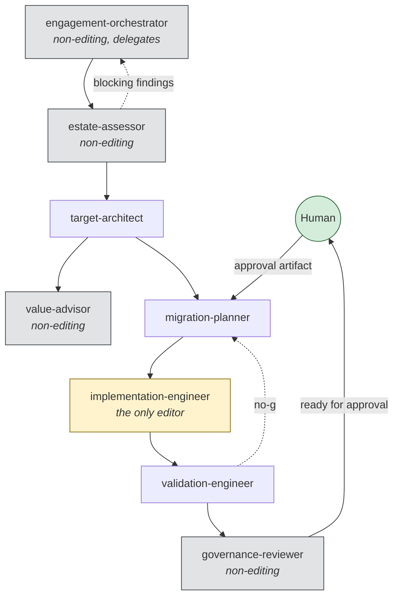
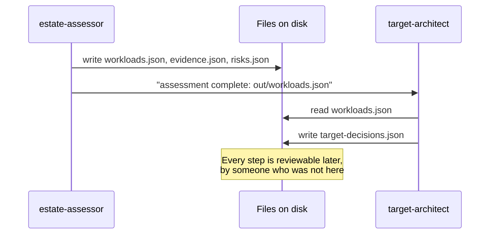

# Agent architecture

Eight agents in an orchestrator-and-workers arrangement, handing off through artifacts on
disk rather than conversation memory.

## The graph

Four of the eight hold no editing tool. One holds the edit tool. One may delegate. The
reviewer may declare readiness and may never approve.

## Privilege

| Agent | Tools | Why that set |
| --- | --- | --- |
| `engagement-orchestrator` | search, read, list, delegate | Routes. Editing would let it fix rather than escalate. |
| `estate-assessor` | search, read, list, runCommands | Runs the read-only pipeline; writes only to the engagement output directory. |
| `target-architect` | search, read, list, create, runCommands | Creates decisions and ADRs. Cannot edit evidence it is reasoning from. |
| `value-advisor` | search, read, list | Drafts a case a human owns. Nothing to write. |
| `migration-planner` | search, read, list, create, runCommands | Creates plans and issue definitions. |
| `implementation-engineer` | + edit, runTests | The only agent that changes repository code. |
| `validation-engineer` | search, read, list, create, runCommands, runTests | Creates validation artifacts; cannot edit the plan it is validating. |
| `governance-reviewer` | search, read, list, runCommands | Runs validators. Editing would let it fix a finding instead of reporting it. |

`dbmodernize validate-agent` enforces this. A non-editing agent that gains `edit` fails the
build, and `tests/agents/test_agents.py` asserts that exactly one agent holds it.

## Why artifacts, not conversation

Conversation memory cannot be diffed, cannot be reviewed by someone who was not present, and
disappears when the session ends — which is precisely when someone asks how a decision was
reached.

So a handoff passes an artifact **path**, never a summary. A summary is a lossy copy of a
file that already exists, and the lossiness is invisible until it matters.

See [ADR-0002](adr-0002-artifact-based-handoff.md).

## Boundaries that hold the system together

**No self-approval.** An agent never approves its own output, and an agent may never approve
agent-authored work at all. Enforced in `models/approval.py` and checked by the agent
validator.

**One delegator.** Only the orchestrator routes between specialists. Otherwise the handoff
graph becomes a mesh and nobody can reconstruct the path a decision took.

**One editor.** Only the implementation engineer changes repository code, and only inside
the files an issue names.

**Readiness is not approval.** The governance reviewer can say "ready for human approval".
That is the strongest statement any agent can make.

## Failure and escalation

Each agent declares what it does when it cannot proceed. The pattern is consistent, and it
is deliberately the opposite of helpful:

- A missing input is **named and escalated**, never synthesised.
- A conflict is **surfaced**, never resolved.
- Another agent's failing output is **returned with the rule quoted**, never repaired.
- A request crossing a safety boundary is **refused with the boundary named**, and the safe
  alternative offered.

An agent that quietly fills a gap to keep the pipeline moving produces a result nobody can
trust and nobody can trace.

## Using them without handoff support

Not every client renders handoff buttons. The graph above works as a manual sequence: run
each agent in turn, pass it the artifact paths the previous one wrote, and read the findings.
The artifacts are the interface, so nothing depends on the host's feature set.

## Adding an agent

1. Decide what it may **not** do first. That determines the tool list.
2. Write `.github/agents/<name>.agent.md` with all eight required sections.
3. If it should not edit, add it to `NON_EDITING_AGENTS` in `validators/agent.py`.
4. Add it to `EXPECTED_AGENTS` in `tests/agents/test_agents.py`.
5. Wire it into the orchestrator's handoff table, and into this diagram.

If the new agent overlaps an existing one, that is a design problem rather than redundancy:
two agents that could handle the same step make the routing unpredictable.
