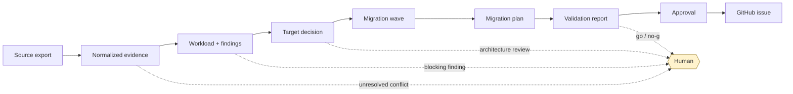
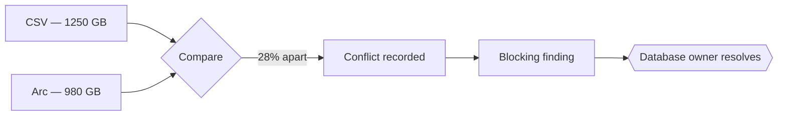
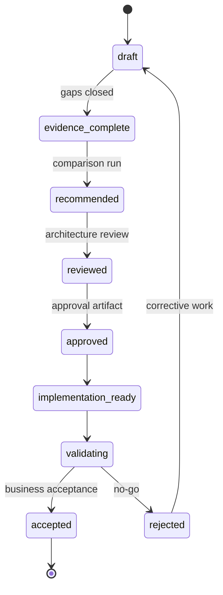

# Artifact and evidence flow

Every statement in every generated document can be traced to something. This page is how.

## The chain

Each arrow carries identifiers, not prose. A target decision names the evidence records it
rests on; a plan names the decisions; an issue names the workload and the decision. The
chain is machine-checkable, and
`tests/integration/test_pipeline_and_cli.py::TestPipeline::test_traceability_chain_holds`
checks it.

## Evidence classes

| Class | Means | Typically from |
| --- | --- | --- |
| `observed` | Measured by a tool or read from a system export | Azure Migrate, Arc, DMS, SSMA |
| `user-provided` | Stated by a human | A CMDB extract, an interview |
| `derived` | Computed deterministically from other evidence | Coverage ratios, support status |
| `assumption` | Filled in to proceed | Anything with an owner and a validation step |
| `recommendation` | A proposal from this repository | Target decisions |
| `approved-decision` | A human signed off | Approval artifacts |

The distinction is enforced, not stylistic. An `EvidenceRecord` cannot carry
`recommendation` or `approved-decision` — the model rejects it — because the moment evidence
and conclusion share a container, nobody can tell which came first.

A CSV row is `user-provided` unless it declares `measured`. That single default is the most
common disagreement in practice, and it is the right default: a spreadsheet records what
someone believed.

## Conflicts stop the line

Two sources disagreeing about a decision-critical attribute produces an `EvidenceConflict`,
and the merged view **omits** the attribute entirely.

Numeric differences within 5% are measurement noise and are ignored. Beyond that, the
repository records the disagreement and refuses to choose.

Taking the newer value, or the more precise one, would hide the more interesting finding:
two systems of record disagree about a production database, and until someone explains why,
neither number is trustworthy. Scenario 05 exercises this.

## Assumptions are structural

An assumption lives in the `assumptions` array with an id, a statement, an owner role, a
validation step, and an impact rating. Never in prose.

Prose assumptions are invisible to review, invisible to search, and invisible to the person
who inherits the engagement. An array can be counted, filtered, and closed.

## Status transitions

`recommended → approved` additionally requires a valid approval artifact whose content hash
still matches. Edit the artifact and the approval becomes stale automatically, which is the
behaviour you want at 17:00 on the day before a cutover.

## Determinism

Identical inputs produce byte-identical outputs, and CI proves it by regenerating every
scenario and failing on any diff.

| Rule | Why |
| --- | --- |
| Time comes from `engagement.as_of` | A wall-clock timestamp makes every rerun a diff |
| Collections sorted before serialization | Iteration order is not a contract |
| UTF-8 with LF everywhere | Windows defaults would otherwise change every file |
| No randomness, no `hash()`, no locale formatting | All three vary between runs or machines |

## Where artifacts live

Working artifacts belong in an engagement folder outside this repository — `/engagements/`
and `/out/` are in `.gitignore`.

Committed artifacts exist only as scenario expectations, and are synthetic. Real evidence
above `internal` classification is referenced by manifest — an id, a hash, and a description
of approved storage — never by content, and never by a credentialed URL.
