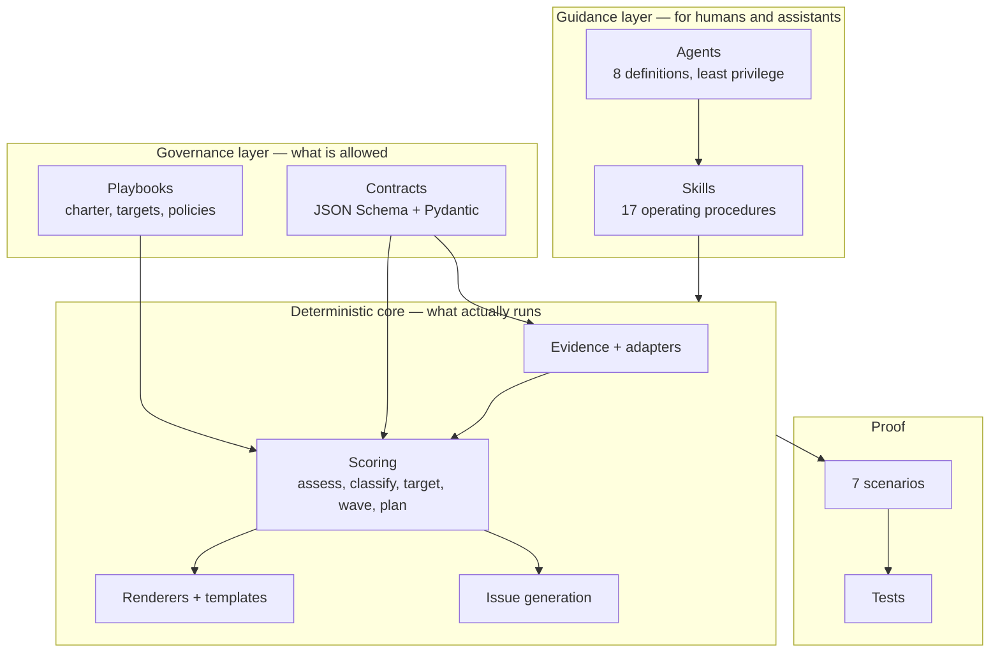
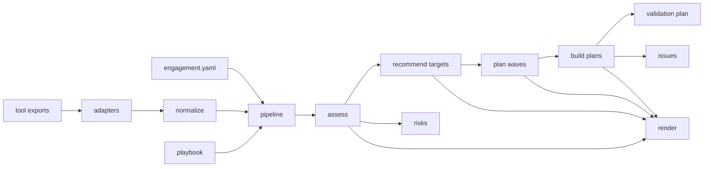

# Architecture overview

## The shape of the thing

Four layers. Each depends only on the ones below it.

The core runs without a model. Skills and agents guide a human or an assistant *through* it;
they never replace it. A recommendation that only a model can produce is not auditable, and
in eighteen months nobody could explain how it was reached.

## Why deterministic

Three properties fall out of it, and all three are load-bearing:

**Reconstructable.** Every score comes from a published adjustment table. A reviewer can
recompute any number by hand, which means a challenge to a recommendation has an answer.

**Reproducible.** The same evidence yields the same decision on any machine, any day. CI
asserts this by regenerating every scenario and failing on a diff.

**Testable.** The safety properties are unit-testable, so "a blocking failure forces no-go"
is a test rather than an intention.

The cost is real: rules cannot read a PL/SQL package and tell you it will be difficult. That
is why skills exist — judgement lives with the human, and the deterministic core holds the
parts that must not drift.

## Module map

| Module | Responsibility | Depends on |
| --- | --- | --- |
| `utils/` | Safe paths, redaction, hashing, UTF-8 LF I/O, logging | Nothing |
| `errors.py` | Exit codes and findings | Nothing |
| `models/` | Pydantic mirrors of the contracts, with cross-field rules | `utils` |
| `policies/` | Playbook parsing and the policy model | `models` |
| `evidence/` | Injection detection, normalization, conflict detection | `models`, `adapters` |
| `adapters/` | One per export format; the only untrusted-input boundary | `models`, `evidence.injection` |
| `scoring/` | Assessment rules, classification, target comparison, waves, plans | `models`, `policies`, `evidence` |
| `renderers/` | Jinja2 over `templates/` | `models` |
| `issue_generation/` | GitHub issue definitions | `models` |
| `pipeline.py` | Runs the chain end to end | Everything above |
| `validators/` | Repository, playbook, skill, agent, schema, status, scenario | Everything above |
| `cli.py` | The command surface | Everything |

Two import cycles were discovered during construction and broken deliberately:

- `validators.scenario` runs the pipeline, so it is **not** re-exported from
  `validators/__init__.py`.
- `evidence.normalize` needs the adapter registry, and adapters need
  `evidence.injection`, so `evidence/__init__.py` exports only the injection helpers.

Both are documented in the module docstrings, because the obvious "tidy" fix reintroduces
them.

## The pipeline

Determinism rules every stage obeys:

- Time comes from `engagement.as_of`, never the clock.
- Collections are sorted before serialization.
- Nothing consults the network, the environment, or a model.

## Where the safety properties live

Not in documentation. In types.

| Property | Enforced by |
| --- | --- |
| A blocked workload gets no destination | `scoring/targets.recommend` |
| A decision shows alternatives | `models/decision.TargetDecision` validator |
| A mutating task is gated | `models/planning.PlanTask` validator |
| A blocking failure forces no-go | `models/validation.ValidationReport` validator |
| An author cannot approve their own work | `models/approval.Approval` validator |
| Zero-downtime language is refused | `models/decision.DowntimeApproach` + repository validator |
| Waves do not share workloads | `models/planning.WavePlan` validator |
| Untrusted paths are contained | `utils/safe_paths.resolve_within` |

A model that refuses to construct an unsafe artifact is stronger than a guideline asking
people not to. The `PlanTask` rule is the clearest example: it is not possible to build a
task that changes an environment without an approval requirement and a rollback note.

## Extension points

| To add | Touch | Then |
| --- | --- | --- |
| An export format | `adapters/` | Fixture in `tests/fixtures/` |
| A scoring rule | `scoring/` | Unit test asserting the adjustment |
| An artifact type | `contracts/` + `models/` | Valid and invalid fixtures |
| A document | `templates/` + `renderers/documents.py` | Regenerate scenario expectations |
| A skill | `.github/skills/` | Selection fixture in `tests/evals/datasets/` |
| A target | `models/base.AzureTarget` + `scoring/reference` + `scoring/targets` | Playbook entry and a scenario |

## What is deliberately absent

- Any Azure, database, or cloud client library. A test asserts this structurally.
- Any network call in the core path.
- Any code path that deploys, migrates, cuts over, or deletes.
- Any model dependency in the merge gate.

See [ADR-0001](adr-0001-deterministic-core.md) and
[ADR-0002](adr-0002-artifact-based-handoff.md) for the reasoning behind the two decisions
that shape everything else.
