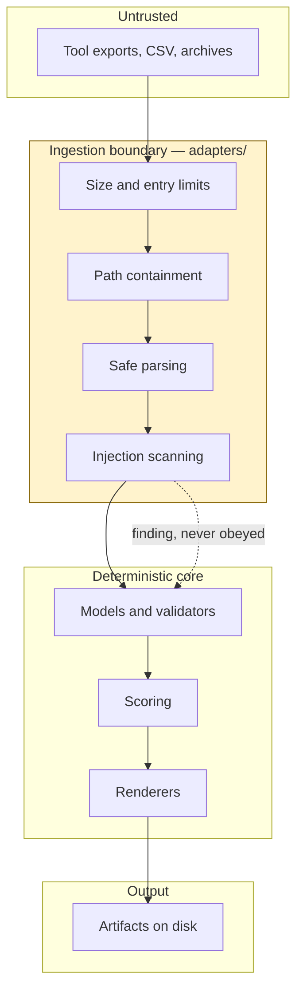

# Security architecture

The threat model is in [SECURITY.md](../../SECURITY.md). This page is how the controls are
arranged, and why they sit where they do.

## The shape of the risk

This repository ingests third-party exports, renders documents, and generates issue
definitions. It holds no credentials and touches no customer system. So the realistic
threats are about **untrusted input** and **accidental disclosure**, not runtime compromise
of a production database.

That shapes everything: most of the defensive code is at the ingestion boundary, and the
strongest control is the absence of a dangerous capability rather than a guard around one.

## Untrusted input

Every export is untrusted: produced by a tool you did not run, on a machine you do not
control, possibly hand-edited on the way.

**Imported text is data.** If it contains something shaped like an instruction, an
`InjectionFinding` is recorded and the text stays data. Eight patterns are detected:
instruction override, role reassignment, system-prompt claims, policy suspension, approval
forgery, secret exfiltration, tool invocation, urgency escalation.

The finding becomes a blocking security finding on the workload, which stops a
recommendation until someone has looked at where the export came from. Detecting injection
and continuing anyway would be theatre.

**Paths are contained.** Anything that becomes a filesystem path goes through
`resolve_within`, which rejects absolute paths, parent traversal, drive letters, symlink
escapes, and embedded NUL bytes.

**Archives are bounded before extraction.** Entry count, per-entry size, total size, and
compression ratio — checked *before* writing, because a limit enforced after extraction is
not a limit.

**Parsing is safe.** `yaml.safe_load` only. No `pickle`, no `eval`, no shell interpolation
of imported content, ever.

## Secrets

Nothing here holds one, and several layers make sure it stays that way:

| Layer | Control |
| --- | --- |
| Prevention | No credential is needed; the core has no client libraries |
| `.gitignore` | Denies `.env`, `*.pem`, `*.key`, engagement output |
| Pre-commit | `scripts/check_no_secrets.py` on staged files |
| Repository validation | Secret patterns and real-looking identifiers |
| Logging | Redacting filter installed at the handler, so a caller cannot forget |
| GitHub | Secret scanning and push protection |

Detection is deliberately stricter than redaction. Redaction can afford a false positive;
a build gate cannot, and `token = token.replace(...)` is ordinary Python rather than a
leaked credential. The two use different patterns for exactly that reason.

Placeholders are obviously fake: `00000000-0000-0000-0000-000000000000`, `contoso.example`,
`REPLACE-ME`. A test scans for anything that looks real.

## Least privilege

**Agents** declare an explicit tool allowlist, validated in CI. Four of eight hold no
editing tool; one holds `edit`; one may delegate.

**Workflows** declare minimal `permissions:` and pin every action to a commit SHA. A
floating tag is someone else's supply chain running with your token, and
`scripts/check_workflow_permissions.py` enforces both rules.

**Cloud access** does not exist. When it eventually does, it uses GitHub OIDC federated
credentials. No long-lived cloud credential will be stored here.

## Capabilities that do not exist

The strongest control in the repository is a missing feature:

- No deployment path. The Bicep is previewed with what-if and applied by a human.
- No migration, cutover, or rollback execution.
- No deletion of anything outside an output directory the caller named.
- No live GitHub issue creation. `--create` is refused by design.
- No client library for Azure, SQL Server, PostgreSQL, MySQL, or Oracle — asserted
  structurally by `test_no_cli_command_can_reach_a_customer_environment`.

A guard can be bypassed. An absent capability cannot.

## Separation of duties

An approval names the artifact, its content hash, the approving role, and the principal. It
is invalid when the approver is the author, when an agent approves agent-authored work, or
when the hash no longer matches.

That last one matters more than it looks: editing an approved artifact silently invalidates
the approval rather than inheriting it, which closes the gap between "what was approved" and
"what is in the file now".

Cutover needs all five owner roles. Four is not a cutover approval, and the count is checked
rather than assumed.

## Data handling

Classification is `public`, `internal`, `confidential`, or `restricted`. Anything above
`internal` must not be committed, and repository validation fails if a tracked file declares
one.

Real evidence stays in approved customer-side storage. This repository holds a manifest: an
id, a hash, and a description of where it lives — never a credentialed URL.

`scripts/redact_fixture.py` converts a real export into a synthetic fixture with stable
pseudonyms. It is an aid, not a guarantee: it cannot know that a project codename is
confidential, so its output needs reading before it is committed.

## Reporting a vulnerability

Privately, through GitHub Security Advisories. Not in an issue, and never with customer
data attached. See [SECURITY.md](../../SECURITY.md).
