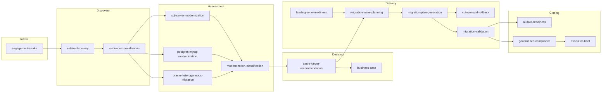

# Skill architecture

Seventeen skills. The hard problem is not writing them — it is making sure the right one is
selected, and that no two could plausibly answer the same request.

## The map

## The eleven sections

Every `SKILL.md` carries the same eleven, and `dbmodernize validate-skill` rejects one that
is missing or is a placeholder:

| Section | Exists because |
| --- | --- |
| Invoke when | Selection needs positive signal |
| Do not invoke when | Selection needs negative signal, **and must name the alternative** |
| Required inputs | A skill run without its inputs produces confident nonsense |
| Preconditions | Some work is wrong to start, not merely hard |
| Procedure | The actual content |
| Decision points | Where judgement is needed, and what tips it |
| Output contract | What the next step can rely on |
| Validation | How to tell it worked |
| Failure and fallback | What to do when it did not |
| Avoid | The mistakes seen in practice |
| Example | One concrete case, end to end |

A section shorter than thirty characters fails validation. "TBD" is not guidance, and a
skill full of TBDs is worse than no skill because it looks complete.

## Selection, which is where skills actually fail

A perfect skill that is never chosen is worth nothing. Four mechanisms:

**Distinctive descriptions.** Between 60 and 500 characters, starting with a verb, naming
specific technologies. Validation warns when two descriptions overlap at 60% or more by word
set, because at that point selection between them is a coin flip.

**Explicit redirection.** "Do not invoke when" must name what to use instead. Validation
warns if it does not. Telling a model what not to do without saying what to do leaves it
improvising, which is the behaviour the skill existed to prevent.

**Cross-family redirection.** The three platform skills each name the other two. The
classic failure is reaching for the SQL Server skill on a PostgreSQL workload; the tests
assert the redirections exist.

**Selection fixtures.** `tests/evals/datasets/skill-selection.yaml` maps eighteen realistic
requests to the skill that should handle them — including one genuinely ambiguous request
where the correct behaviour is to *ask* rather than guess. Every skill must be the expected
answer for at least one case; a skill nothing selects is a skill nobody reaches.

## Safety language

The validator scans for guidance that would be unsafe if followed literally: zero-downtime
claims, auto-approval, direct production changes, credential literals.

It is section-aware, and that matters. A bullet under "Avoid" reading *"Claiming zero
downtime under any wording"* is a prohibition, not an assertion. Without that awareness the
check fires on the sentence written to prevent the very thing it detects — and the usual fix
is deleting the guidance, which keeps the risk and loses the warning.

The mechanism lives in `utils/text.py` and is shared with the repository validator, so both
behave identically.

## Skills against playbooks

Skills hold **procedures**. Playbooks hold **decisions**.

Copying a procedure into a playbook makes improving the procedure a governance event, which
in practice means it stops being improved. Copying a decision into a skill means the
organisation's position is asserted in seventeen places and drifts in sixteen of them.

Where a skill needs a decision, it reads the playbook at run time and records the policy ids
it applied.

## Adding one

1. Write the description first. If you cannot distinguish it from every existing skill in a
   sentence, the skill is not distinct.
2. Write "Do not invoke when" second, naming alternatives. This is the part that makes the
   library navigable.
3. Fill the remaining nine sections. No placeholders.
4. Add a case to `tests/evals/datasets/skill-selection.yaml`.
5. Add it to `EXPECTED_SKILLS` in `tests/skills/test_skills.py`.
6. `dbmodernize validate-skill .github/skills`.

## Known limits

Selection testing here is a proxy: it checks that a skill's vocabulary matches the requests
it should serve, and that descriptions do not collide. It cannot prove a model will choose
correctly.

Proving that needs model-based evaluation, which lives in a separate, non-gating workflow
precisely because it is non-deterministic. Gating merges on it would teach people to re-run
until green.
