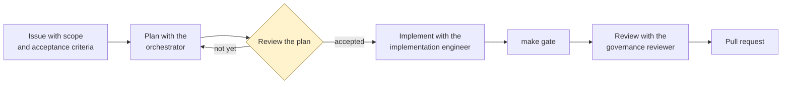

# Getting started with Copilot here

## What Copilot reads automatically

| File | When | Contains |
| --- | --- | --- |
| `.github/copilot-instructions.md` | Always | The canonical rules: mission, stack, commands, safety boundaries, evidence model, definition of done |
| `.github/instructions/*.instructions.md` | By `applyTo` path | Rules for Python, schemas, security, tests, migration content, infrastructure, documentation |
| `.github/skills/*/SKILL.md` | On selection | Operating procedures |
| `.github/agents/*.agent.md` | When you choose an agent | Objective, inputs, outputs, decision rights, escalation |

`AGENTS.md` and `CLAUDE.md` are thin compatibility layers pointing at the same canonical
file. They add tool-specific conventions only; duplicating the rules would guarantee they
drift.

## The loop



Two properties make this work:

**Plan before implementing.** An issue without a file-by-file plan produces a change that
touches more than it should, and reviewing it means reconstructing the intent from the diff.

**Different agent for review.** The agent that wrote the code is the worst reviewer of it,
for the same reason the author of a decision cannot approve it.

## First session

```text
Read .github/copilot-instructions.md and docs/architecture/overview.md.
Then run:
  make install-dev
  make gate
  dbmodernize validate-scenario scenarios/01-sql2016-to-managed-instance
Summarise what the repository does and what it refuses to do.
```

If the summary does not mention that it produces plans rather than executing them, the
instructions are not landing and that is worth investigating before doing anything else.

## Naming a skill

Copilot selects skills from the task description. Name one explicitly when the boundary is
ambiguous:

```text
Use the azure-target-recommendation skill to evaluate the normalized workloads in
scenarios/01-sql2016-to-managed-instance. Do not modify the approved playbook.
Produce a target decision artifact and list every unresolved evidence gap.
```

Note the three parts: the skill, the scope, and an explicit prohibition. The prohibition
matters more than it looks — without it, a model that finds the playbook inconvenient will
sometimes suggest changing it.

## Choosing an agent

| Task | Agent |
| --- | --- |
| Where are we, what is next? | `engagement-orchestrator` |
| Assess an estate | `estate-assessor` |
| Compare targets | `target-architect` |
| Build the business case | `value-advisor` |
| Plan waves and issues | `migration-planner` |
| Write code | `implementation-engineer` |
| Validate an outcome | `validation-engineer` |
| Review before approval | `governance-reviewer` |

Only the implementation engineer can edit code. If you ask a read-only agent to fix
something, it should refuse and tell you why.

## Accepting output

Never because it compiles.

Before accepting: inspect the diff, confirm it stayed in the files the issue named, run
`make gate`, read the assertions rather than counting the tests, check the documentation
matches the implementation, and look for a secret, a customer datum, or an undated product
claim.

For anything touching `contracts/`, `playbooks/`, `.github/agents/`, or a safety boundary,
get a second review with the governance reviewer.

## Where it goes wrong

**The model wants to help by filling a gap.** Unknown version, unstated RPO, missing cost. It
will offer a plausible value. The instructions forbid this, but it is the strongest pull in
the system — watch for it specifically.

**A summary instead of an artifact.** Handoffs pass paths. A summary is a lossy copy of a
file that already exists.

**Scope creep dressed as tidying.** "While I was in there" is how a one-file change becomes a
twelve-file review.

**Confident product claims.** Support dates, service limits, preview status. Anything
perishable needs a `verified_on` date or should not be stated.

## Next

- [Working with agents](working-with-agents.md)
- [Working with skills](working-with-skills.md)
- [Issue-driven development](issue-driven-development.md)
- [Prompt recipes](prompt-recipes.md)
- [Review checklist](review-checklist.md)
