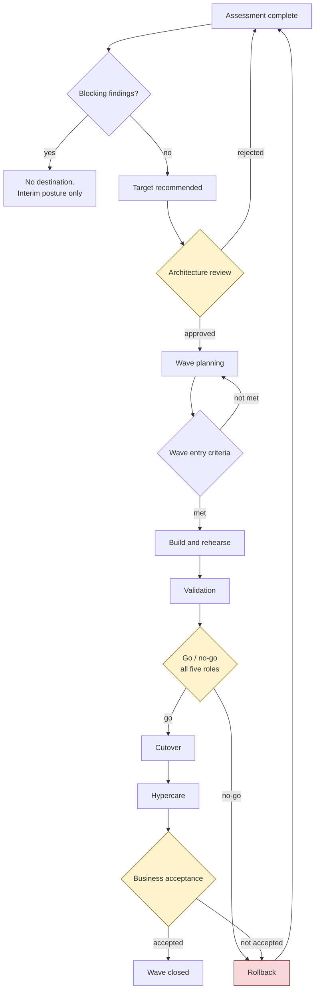

# Risk and approvals

## Risk scoring

Likelihood times impact, each `low`(1), `medium`(2), `high`(3).

| Score | Severity | Requires |
| --- | --- | --- |
| 1–2 | low | An owner |
| 3–4 | medium | An owner and a mitigation |
| 6 | high | A contingency as well |
| 9 | blocker | A contingency, and it blocks a wave gate |

The distinction between mitigation and contingency is the useful part. A **mitigation**
reduces the chance. A **contingency** is what you do when the mitigation did not work — and
scoring 6 or more without one means the plan assumes nothing goes wrong.

The model rejects a high or blocker risk with no contingency.

## Acceptance is attributed

A risk may be accepted. It must name the accepting role and the date.

Unattributed acceptance is not acceptance; it is a risk that stopped being discussed and
acquired the appearance of having been resolved. The model enforces this.

## Derived risks

Every blocking finding becomes a risk automatically, with an owner derived from the finding
category:

| Category | Owner |
| --- | --- |
| dependency | application-owner |
| security | security-owner |
| availability, operations | operations-owner |
| licensing, cost | business-owner |
| everything else | database-owner |

Automatic derivation means the register cannot quietly omit the thing the assessment
actually found — which is the failure mode of hand-maintained registers.

## Approval gates



Three human gates. None can be passed by anything in this repository.

## What an approval contains

Artifact id, **content hash**, approving role, principal, timestamp, decision, conditions,
and an optional expiry.

An approval is invalid when:

- the approver is the artifact author,
- an agent approves agent-authored work,
- the content hash no longer matches,
- a cutover is missing any of the five roles,
- the artifact's status cannot legally transition.

The hash check is the one that repeatedly earns its place: it catches the small, well-meaning
edit made after sign-off and before execution.

## Conditional approval

`approved-with-conditions` requires the conditions to be listed. An unlisted condition is a
private understanding, and private understandings do not survive a change of personnel.

Conditions are tracked to closure like any other work.

## Reading the trail

```bash
dbmodernize validate-repo
dbmodernize validate-playbook playbooks/default
```

Then, for the engagement: does every artifact with an approved status have a matching
approval? Does every hash still match? Is any exception expired? Is any high risk without a
contingency or a due date?

The `governance-compliance` skill walks this systematically and reports blocking findings,
non-blocking findings, and one explicit statement of whether the plan is ready for human
approval.

## When an approver is unavailable

Escalate to the sponsor. Naming a deputy is their decision, not the delivery team's, and not
something to settle at 22:00 on the night.

Proceeding with four of five is not an option the tooling offers, and that is deliberate.
